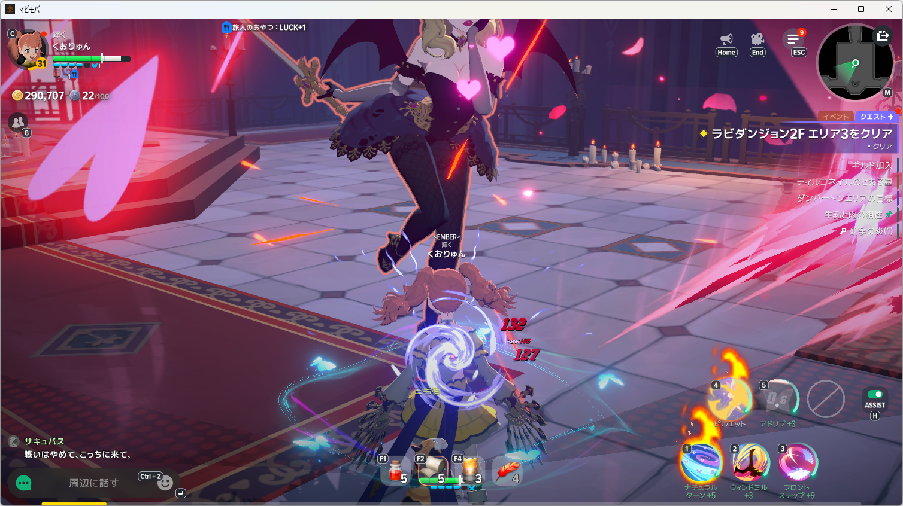
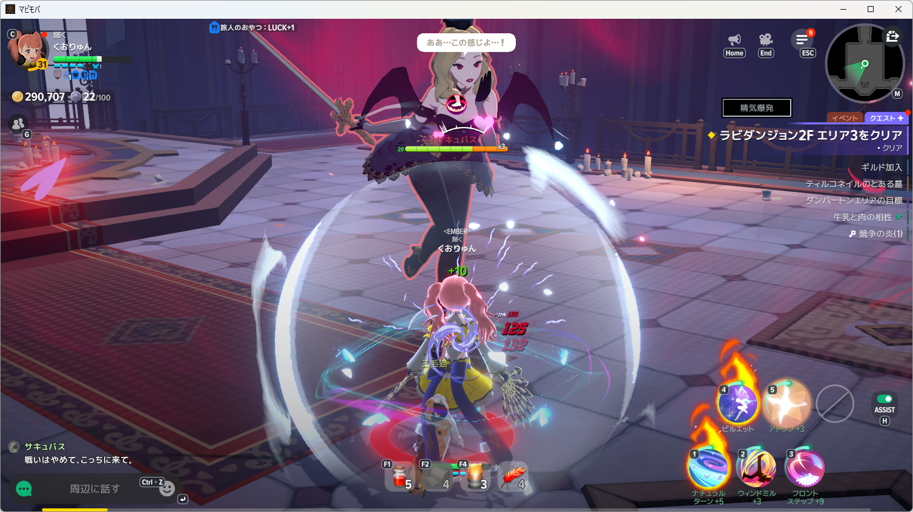

# 包帯未送出の修理・再戦実測

- 実測日: 2026-10-08
- 対象: Windows native開発版、マビノギモバイル、NanoSerialHid
- 判定: 包帯の使用は確認済み。戦闘クリアは未成立。
- 原本: `artifacts/diagnostics-tools/mabinogi-main-20261008/bandage-latch-run001/`、同名JSONとlogを保持。

## 修理と検証

白20％の使用要求を送出直前の別画像で再判定し、白が減ると要求を消していた。要求をF2送出まで保持する修理を行った。停止画像・HUD非表示・死亡・画像判定エラー時は取り消す。

再現を含むfocused 24件が成功。実戦終了後のHost関連400件も成功。正規入口`install-development-app.ps1`で開発版へ導入済み。Releaseと導入済みHost DLLのSHA-256はともに`36F3E599E92936845E47D5EFBCFAA2088D2937DC9B823A0A7D91C0E5AC7CBDF2`。

## 再戦の観測

| 経過 | 観測・入力 |
| --- | --- |
| 0.422秒 | Bを1回送出 |
| 1.482秒 | 食事効果中・HP枠131→198 |
| 95.996秒 | HP67.7％・白21.2％で包帯候補 |
| 96.156秒 | F2を1回送出 |
| 96.402秒 | HP61.6％・白25.8％、包帯結果待ち |
| 96.969秒 | HP55.6％・白6.1％、結果待ち解除 |
| 98.195秒 | HP48.5％でF1を1回送出 |
| 101.419秒 | HP13.1％、ポーション後のHP増加を観測できず停止 |

下の前後画像では包帯5→4、使用後の「＋10」を確認できる。F2はNanoSerialHid・1回・エラーなし。後の敗北画面でも包帯4、ポーション4を確認した。AI呼出しは0回。

白は包帯未使用時にも減るため、白すべてが負傷なのか、今回の減少がどれだけ治療によるものかは未確認。ポーションの使用と回復成功も区別し、HP回復・戦闘継続・クリアは未成立とする。

次の方針をApproval Box `K-KRVKSE`へ前後画像付きで申請。ゲーム入力を停止して回答待ち。上級ポーションへの変更は未実施。
