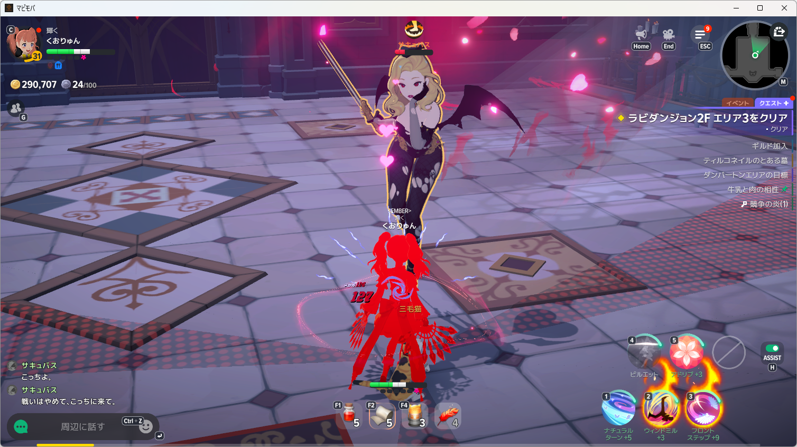
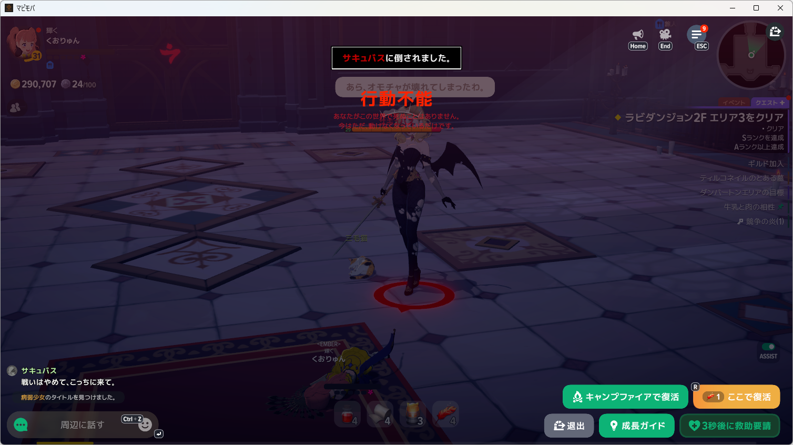

# 食事の再使用間隔とHP監視を分離する修理

- 実測日: 2026-10-08
- 対象: Windows native開発版、マビノギモバイル、NanoSerialHid
- 利用者指示: 普通のポーションのまま再挑戦。食事・復活など完了済みの操作を重複実行しない。

## 引き継いだ再戦の結果

原本は`artifacts/diagnostics-tools/mabinogi-main-20261008/retry-after-death-fix-run001/`と同名JSON。F2を55.669秒に1回送出した。F1、Bは0回。106.313秒でHP91.8％、白4.5％、食事使用前のB表示を検出し、「食事の効果時間内に使用前の表示へ戻りました」で処理全体が終了した。保存画像にもB表示と短くなったHPバーがある。

永続状態の`LastFood`は05:52:17 UTC、終了は06:12頃で、食事から約19分49秒。設定の20分は食事の再使用間隔であり、効果が必ず継続するという保証にはならない。表示が戻った時に食事の追加使用を抑えるだけでなく回復監視も終了していたことが原因。継続時の入力なし観測で敗北画面を確認した。停止後のHP推移は記録されておらず、最終的な敗因の内訳は未確認。

## 修理と検証

再使用間隔内に食事使用前表示が戻った場合は、Bを送らず理由を記録しHP・包帯監視を続ける。20分の間隔、HP50％、F1の10秒待ち、白20％、死亡時の終了は変更しない。

永続状態から再開して19分49秒でB表示へ戻る条件を再現したテストは、修理前に失敗、修理後に成功。同じ観測列からHP40％でポーション、白25％で包帯の判断へ進み、追加食事と未送出操作の記録がないことも確認した。focused 28件、Host関連404件が成功。

正規`install-development-app.ps1`で開発版を更新。導入済みHost DLLとRelease成果物はSHA-256 `BDD16BF0B5E93111A1D22A5329E9A54DAA5B9761B46351E51C1E26BEE77BF5D5`で一致した。

## 修理後の再戦

原本は`artifacts/diagnostics-tools/mabinogi-main-20261008/food-monitor-run001/`と同名JSON。敗北画面から指定済みのキャンプファイアで復活し、入力なしでHP全快・食事使用前を確認して開始。前の食事から20分以上経過している。Bを0.442秒に1回送出、1.135秒に食事効果表示とHP全長131→198を確認した。

| 経過 | 観測・操作 |
| --- | --- |
| 106.199秒 | HP74.7％、食事効果中、監視継続 |
| 111.577秒 | Spaceは画面変化未確認で停止。HP監視は継続 |
| 111.858秒 | HP49.5％でポーション候補 |
| 112.279秒 | 白20.2％で包帯を優先 |
| 112.448秒 | F2を1回送出 |
| 112.748秒 | HP39.9％、ポーション候補 |
| 112.931秒 | F1を1回送出 |
| 113.200秒 | HP33.3％。10秒の待ち時間中も監視継続 |
| 115.728秒 | HP20.2％、白4.0％ |
| 116.296秒 | HP7.1％、白11.6％ |
| 117.313秒 | HUD非表示 |
| 119.025秒 | 行動不能表示を認識し、処理終了 |

前後画像でポーション・包帯とも5→4を確認。B・F1・F2は各1回、AI呼出し0。Nanoエラーと、HP増加未観測による停止は発生していない。F1から約4.4秒でHUDが消え、次回使用の10秒には到達しなかった。使用後の回復量と被ダメージを分離できていないため、ポーションの回復量不足だけを敗因と断定しない。

今回は敗北表示で終了し、敗北後の追加消費は0回。終了後にHost processが残っていないことも確認した。敗北後も監視を継続して復活中にF2を使う欠陥の修理は、今回の実戦で確認できた。食事の再使用間隔内にB表示が戻る条件は今回の再戦中には発生しておらず、修理の直接検証は再現テストによる。

原本から抽出した[イベント列](food-monitor-events.jsonl)を保持。上級への登録変更は行っていない。次の方針はApproval Box **K-D2CYMH**へ申請済み。現在は敗北画面で入力停止、回答待ち。
