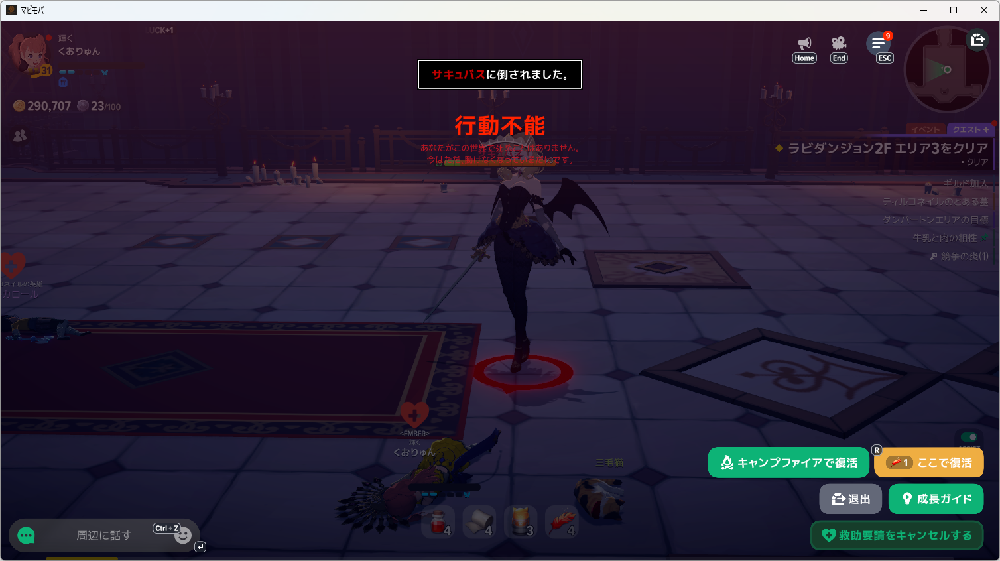

# ポーション後の監視継続修理・普通のポーションでの再戦

- 実測日: 2026-10-08
- 対象: Windows native開発版、マビノギモバイル、NanoSerialHid
- 利用者回答: Approval Box `K-KRVKSE`「普通のポーションで再度やって」
- 判定: HP増加未観測による監視停止の修理は確認済み。普通のポーションでの戦闘クリアは未成立。

## 修理と導入

F1前48.5％→約3.224秒後13.1％をテストで再現し、修理前の監視終了を確認した。HP差分は被ダメージも含むため、増加未観測で終了する条件を除いた。10秒の待ち時間と50％の基準を維持し、HP・包帯の監視を続ける。以前の確認待ち状態も読み直せる。Nano送出エラー、死亡、画像判定不能の扱いは維持した。

focused 26件、最終Host関連402件が成功。正規開発版への導入を完了。Releaseと導入済みHost DLLのSHA-256はともに`477012D37FF5EE68998656BE0E52CC05C89C2F90AAB42179F39C07662C3AB3CC`。導入後のobserve-onlyで画像取得・入力0・AI呼出し0を確認した。

## 普通のポーションでの実戦

原本は`artifacts/diagnostics-tools/mabinogi-main-20261008/potion-monitor-run002/`、同名JSONとlogを保持。上級への登録変更なし。復活直後のrun001は遷移中の白一色HP表示で止まったため、全快を入力なしで確認してからrun002を開始した。

| 経過 | 観測・操作 |
| --- | --- |
| 0.496秒 | 食事Bを1回送出 |
| 1.165秒 | 食事効果中、HP枠131→198 |
| 89.220秒 | 白21.2％で包帯F2を1回送出 |
| 90.496秒 | 白9.1％、HP51.5％ |
| 91.158秒 | HP44.4％で普通のポーションF1を1回送出 |
| 92.944秒 | HP29.3％、待ち時間中も監視継続 |
| 94.399〜94.856秒 | HP枠の識別待ち。ポーション後3秒での終了は発生せず |
| 95.291秒 | HUD非表示 |
| 103.067秒 | 保存画像で敗北を確認 |
| 103.132秒 | Space停止、回復監視継続 |

戦闘中のF1・F2はNanoSerialHidで各1回送出。画像で包帯5→4、ポーション5→4を確認した。F1から約4.1秒でHUDが消え、次回使用の10秒に達する前に倒された。HPが増えなかったことによる監視終了は修理できたが、回復量・被ダメージ量を数値で分離できておらず、普通のポーションで生存できることや次回F1実送出は確認していない。白減少の治療との因果も断定しない。

## 敗北後に発見した余分な包帯送出

回復監視は指定の180秒まで続いていた。168.237秒に画面が復活地点へ変わり、HP32.8％・白67.2％を検出、168.343秒にF2をもう1回送出した。復活操作の主体はログから不明。保存画像は起き上がる途中の白いHP表示であり、治療の必要性は確認できない。実行全体ではB1回・F1 1回・F2 2回。170.716秒にHP100％へ戻り、現在は復活地点。指定時間終了により入力処理は終了した。

原因は、HUDが隠れる敗北画面を「HUD非表示で消費しない」と扱うだけで、実行を終了しなかったこと。ゲーム別設定に行動不能の表示文字を置き、既存のWindows OCRでその表示を認識した時は回復観測を明示エラーとし、その実行を終了するよう修理した。ゲーム固有の表示は本体に埋め込んでいない。実際の敗北画像と空白入りOCR文字列の再現テストで停止判定を確認した。修理後にもう一度敗北して確かめる実戦は行っていない。

追加修理後のHost関連403件成功、開発版更新済み。最終Host DLLはReleaseと導入版ともにSHA-256 `C91EE4E6BD09DE36ED18EAA15549608DA09CA47EC23C98A5707819134E569082`。導入後のobserve-onlyで復活地点・HP100％・食事効果中・白0％、入力0・AI呼出し0を確認した。処理は終了しており追加の再戦は行っていない。抽出した原本ログは[potion-monitor-events.jsonl](potion-monitor-events.jsonl)。
