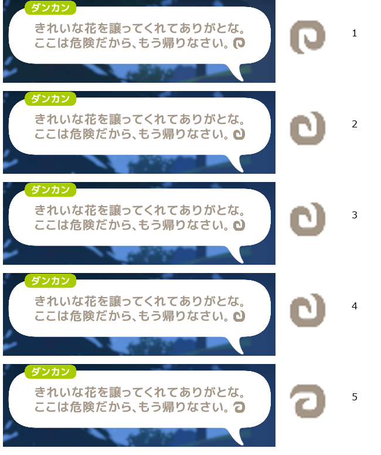

# スクリプト主体の進行と回転する会話表示

取得日: 2026-10-08。確度: 以下の保存画像・Windows native実行は確認済み。任意の場面への汎化と長時間の無人運転は未確認。

会話送り、報酬受領、自動着用、装備確認、退出を、画面の文字・配置・画像に束縛する進行設定へ実装した。回復は独立した250ms周期、Nano入力は共通の直列化経路。未知画面・操作結果未確認・ボーナス選択では両処理を終了し、停止理由・画像・選択肢をApproval Boxへ自動申請する。回答は操作者が確認し、現在画面を確認してから再開する。

## 中断前からの実測

スクリプトだけで会話末尾、巨大白色クモの討伐、ダンカンへの報告、報酬受領へ進んだ。未知画面でK-T4FB5Gへ通知し、「この場合はSpace」の回答受信を確認。その後のボーナスK-UTK4QJで「LUCK成長」を指示され、Nanoで選択・確定した。以後は各3択のOCR見出しを通知へ添える。

保存済み[進行ログ](progress-script-events.jsonl)・[停止画面](progress-script-stop.png)・[通し試験](progress-tests.log)を保持。中断前の最終通し試験は22プロジェクト1,521件成功。その後、会話のOCR破損でK-2G2UEMへ停止通知した。

## 回転する印への対応

利用者提供の渦巻き画像を参照として使用。静止した向きの一致を要求せず、画素の色で印と周囲の文字を分け、36方向の形と比較する。NPC名・台詞・クエスト名は持たない。画像、探索範囲、倍率は進行設定へ置く。印に加えて会話領域に文字があることを必要とし、完全なOCR欠落には対応しない。

停止時の原本と破損OCRを使う再現試験は修理前に失敗した。修理後は実画像、6通りの回転・倍率・位置変更、HUD・ボーナス・レベル表示の負例8枚、会話から印だけ消した負例が成功。関連Host試験は[434件すべて成功](progress-cue-tests.log)。中断前に済んだ通し試験は再実行していない。

開発版更新後、導入済みHost DLLとRelease成果物のSHA-256は一致。参照機での入力なし観測は5枚、印の画素列は3種類、5枚すべて`npc-dialogue-cue`。ゲーム入力0回・AI呼出し0回。[観測JSON](rotating-cue-observations.json)と[比較画像](rotating-cue-observations.png)を保持する。観測1は導入直前のDebug製品、2〜5は導入済みRelease製品。

## 導入後の自動進行

既存の「通常会話はSpace」の指示と利用者提供の印により操作可否が確定したため、K-2G2UEMを取り下げて再開。導入済み製品の`game-index key-assist`だけで106.9秒動作した。

| 送出 | 回数 | 結果 |
|---|---:|---|
| 回転する印を検出した会話Space | 7 | 最後の台詞から別の会話へ進行 |
| 報酬のSpace | 1 | クエスト報酬後のレベル表示へ進行 |
| レベル表示のSpace | 1 | 表示を閉じた |
| 通常／Space表示の入力 | 2 | Nano経由で送出 |
| 食事B | 1 | 効果中を観測し、追加消費なし |
| ポーション／包帯 | 0／0 | 使用条件に未到達 |
| AI | 0 | Jevを含め製品の通常判定には未接続 |

[全イベント](progress-cue-events.jsonl)を保存。最終的にレベルガイドで未知画面停止し、[画像](progress-cue-stop.png)付きのK-4VXGV3を自動作成した。停止後の入力・消費なし。返信先は現在の会話へ引継済み。未知画面の無断突破はしていない。

Jevは別途[保存OCR3例の分類実験](../../rag/openlogicool/typesafe-screen-routing-2026-10-08.md)で使用した。画像入力と、未知画面をJevへ渡して製品操作へ接続する機能は未実装。今回の回転表示への対応にAPI費用は発生しない。

K-4VXGV3の回答は『キア1Fに入ればいいよ』。回答後、Nanoでレベルガイドの移動を選び、ダンジョンへの自動移動を確認した。`progress-flow007`でスクリプトを再開。キア入場後の結果は別の実測として扱う。

キア1Fエリア1への入場を画面で確認（入場前41枚→入場後31枚）。回答の範囲に含まれる入場操作で再度出たK-C84C6Rは重複として取り下げた。`progress-flow008`で自動進行と回復監視を再開。
