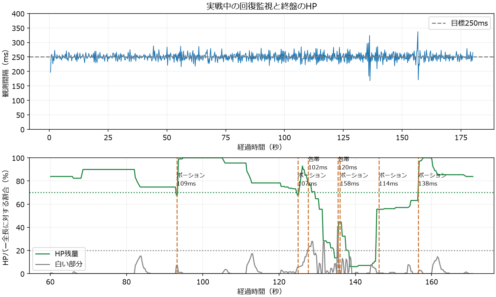
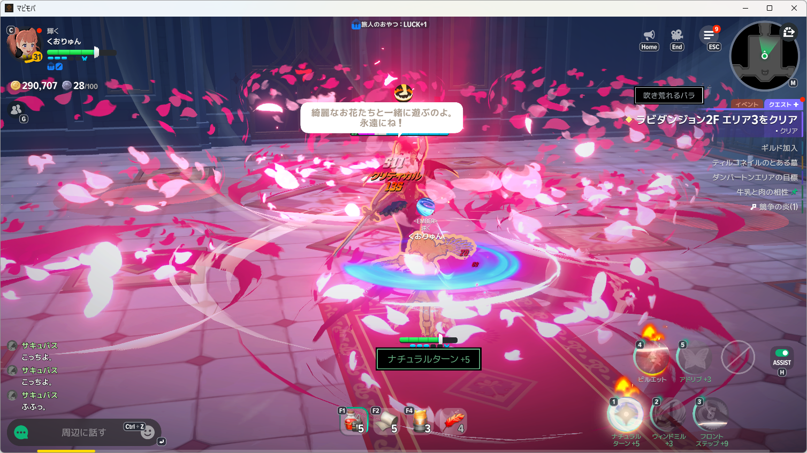
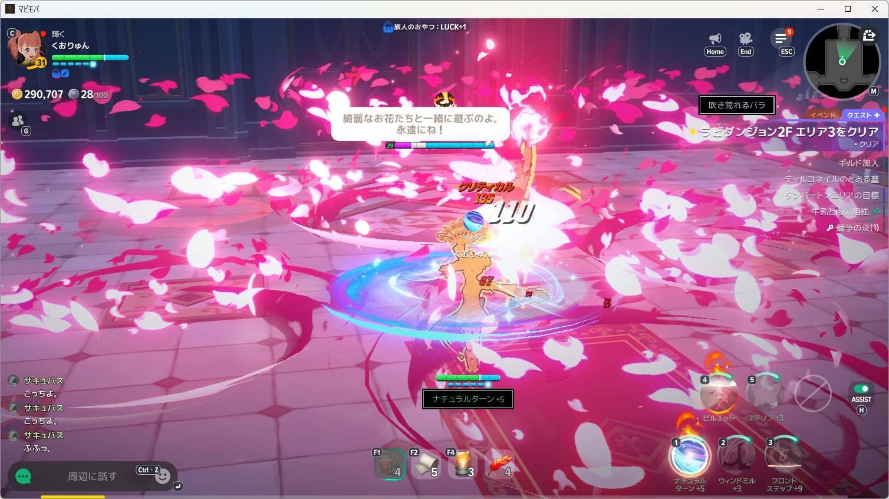
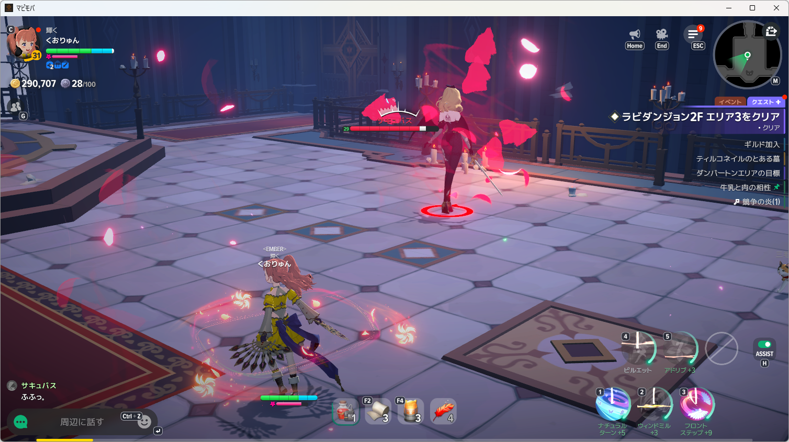
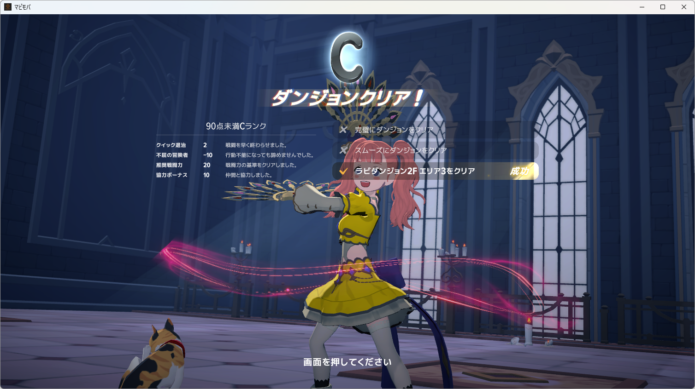

# 上級ポーション・HP70％での再挑戦

判定: **確認済み**。上級自動回復ポーションへ登録変更後、サキュバスを倒し、ラビダンジョン2Fエリア3のCランク・クリア成功を実画面で確認した。

利用者の「次は上級のポーションで挑んでくれ」に従い、敗北画面から指定済みのキャンプファイア復活を行い、ゲーム内の着用案内から上級自動回復ポーションを登録した。F1スロットの説明で、HP1600即時回復・10秒待ち・所持40・「クイックスロットから外す」を確認した。食事効果と追加HPが残っていたため、追加のB送出は0回。装備・スキルは変更していない。

製品コード・設定の変更はない。導入済みHostの`game-index key-assist`で、既存の70％基準・包帯の白20％・250ms監視を使った。入力はNanoSerialHid、AI呼出し0。コード変更がないため、既に成功している関連テストは再実行していない。

| 経過秒 | 送出 | 検出から送出まで |
| --- | --- | --- |
| 93.163 | F1 1回目 | 109ms |
| 124.921 | F1 2回目 | 107ms |
| 127.650 | F2 1回目 | 102ms |
| 135.459 | F2 2回目 | 120ms |
| 135.979 | F1 3回目 | 158ms |
| 146.177 | F1 4回目 | 114ms |
| 156.480 | F1 5回目 | 138ms |

最初のF1直前はHP67.7％。送出から約449ms後の観測で98.99％へ増えた。実画面で3回目のF1後にポーション2・包帯3を確認した。5回目のF1前後の保存画像ではポーション1・包帯3が表示され、HPは送出から264ms後に63.1％→97.0％へ増えた。最終残数0は撮影できていないため、F1送出5回と消費数の完全一致は未確認。ゲーム自身の自動使用機能も付いた品なので、全回復量をNano入力だけの効果とは断定しない。

回復観測720回。間隔は中央値249ms・95％点272ms・最大337ms。35.675秒で通常Spaceの画面変化未確認により進行入力を停止したが、回復監視は180秒の指定期間まで継続し、終了コード0。クリア後に追加入力せず、結果画面で停止している。

[観測と送出の全ログ](recovery-advanced-events.jsonl)。原本・各操作の送出結果・製品撮影画像は`artifacts/diagnostics-tools/mabinogi-main-20261008/advanced-*`に保持する。過去の敗北記録、食事・包帯・ポーションの設定、NIKKE原本は保持した。
