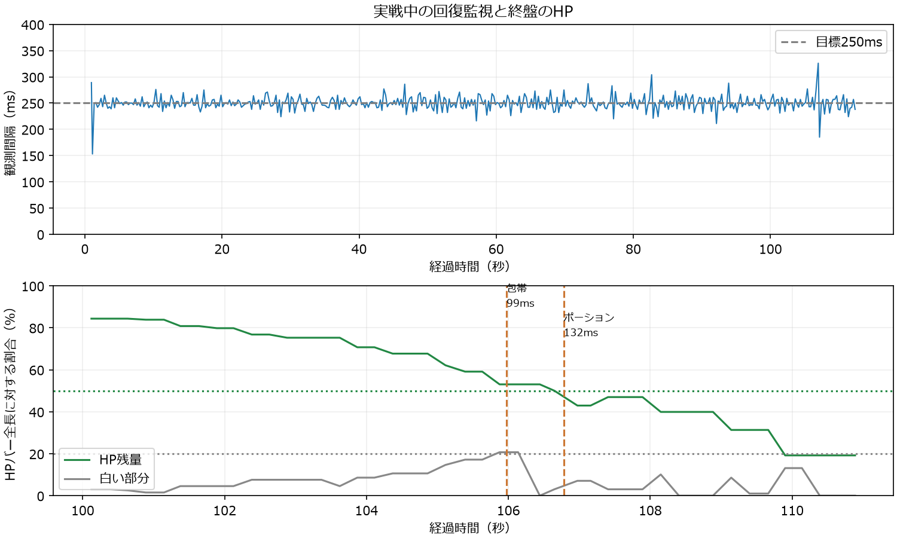
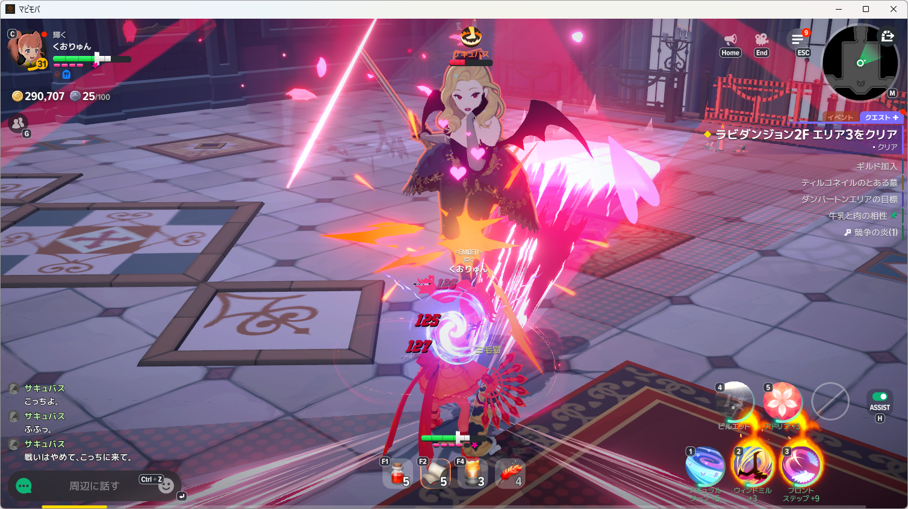
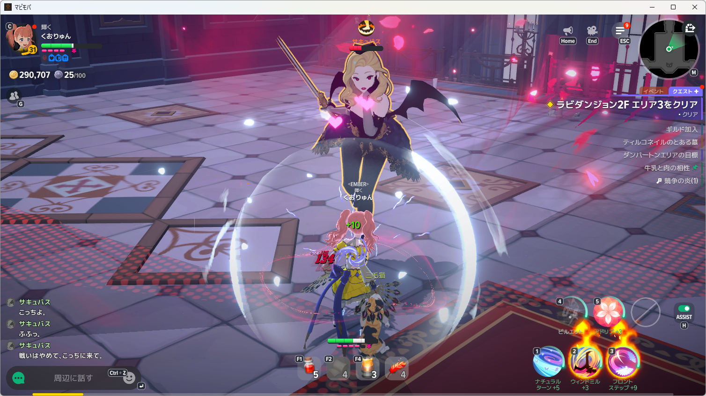
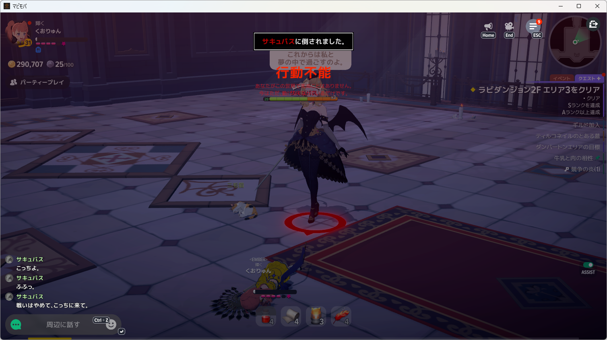

# 回復監視の分離と毎秒4回の実測

- 対象: Windows native開発版、マビノギモバイル、NanoSerialHid。
- 判定: OCR・Space後の待機からの回復監視分離、250ms周期、実戦中のF1/F2送出と敗北時終了は確認済み。戦闘クリアは未成立。
- 使用条件: HP50％以下で通常ポーションF1、白20％以上で包帯F2。待ち時間はそれぞれ10秒・5秒を維持。装備・登録変更なし。

## 修理

従来は同じループでOCR、Space後の1秒待ち、画面比較を待ち、実戦ログでHP観測が約2.3秒空いていた。回復を独立した250msタイマーと専用WGC取得経路へ分離した。進行用OCRと比較は回復処理を待たせない。Nano送出は共通の排他区間に限定し、送出中も他方の回復観測を継続する。進行入力の直前には、回復入力で更新された進行期限も確認する。

死亡・障害・時間切れで他方の処理も取り消して回収する。HUD非表示の死亡確認OCRは回復監視を待たせず実行する。`recovery-sample`に実測間隔と画像鮮度、送出イベントに条件検出から送出までの時間を保存する。計測専用の`--measure-only`では前面化・進行キー・消費キー・回復状態保存を行わない。

## 開発版での実測

復活地点で入力なしの15秒計測を行い、HP100％・白0％・枠131を読み取った。回復観測60回、中央値249ms、95％点267ms、最大270ms。進行と回復のキー送出は0回。

次に食事と通常ポーションのままサキュバスへ再挑戦した。食事B後に効果表示と枠131→198を確認。回復観測448回、中央値249ms、95％点270ms、最大326ms。34.495秒でSpace後の比較が未確定となり進行を停止した後も、回復観測は継続した。

| 経過 | 実測 |
| --- | --- |
| 0.834秒 | 食事B送出。条件検出から173ms |
| 105.876秒 | HP53.0％・白20.7％で包帯候補 |
| 105.974秒 | 包帯F2送出。条件検出から99ms |
| 106.443秒 | 白0％を観測。包帯残数5→4は次の送出前画像でも確認 |
| 106.648秒 | HP50.0％でポーション候補 |
| 106.779秒 | ポーションF1送出。条件検出から132ms |
| 106.973秒 | HP42.9％ |
| 107.405秒 | HP47.0％。増加は観測したが包帯と被ダメージもあるため、薬単独の回復量とは断定しない |
| 109.901秒 | HP19.2％。ポーション待ち時間中も観測継続 |
| 111.144秒 | HUD非表示。F1から約4.4秒 |
| 112.346秒 | 行動不能を検出し、両処理を終了 |

敗北画面で通常ポーションと包帯はいずれも残数4、送出は各1回。敗北後の追加消費は0回。次回ポーションの10秒まで持たなかった。監視ループの停止・長い観測空白による敗北とは区別する。装備不足や薬の回復量だけを敗因として確定していない。

## 検証と所在

同期OCRを停止させたまま4回の回復観測とHP40％でのポーション判断が成立する再現試験、死亡・障害による他方の取消・回収を含めfocused 8件成功。最終Host関連407件成功。正規`install-development-app.ps1`で更新し、Releaseと導入済みHost DLLのSHA-256はともに`08E667E570411DBCAED5449DA1FFA24E2208EC8A1DFD9FE7BC1F3F51FA9734C3`。

入力なし計測は[観測ログ](recovery-cadence-observe-events.jsonl)、実戦は[実戦ログ](recovery-cadence-events.jsonl)。元のJSON・画像・ログは`artifacts/diagnostics-tools/mabinogi-main-20261008/cadence-measure002`と`cadence-live001`に保持。AI呼出し0、入力はNanoSerialHidのみ。
