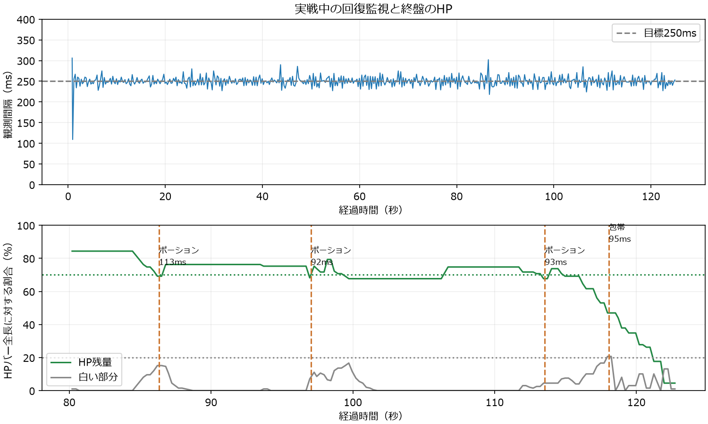
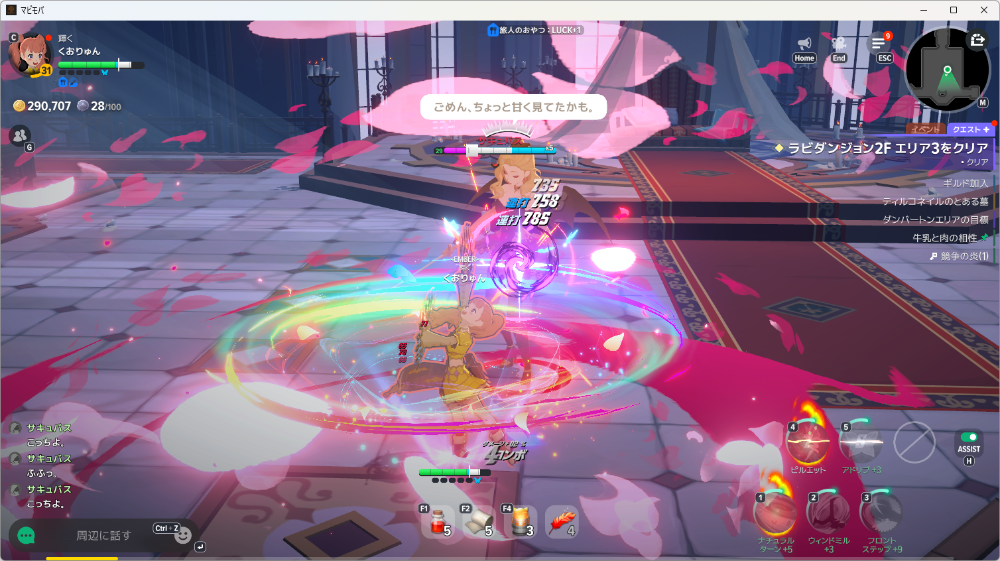
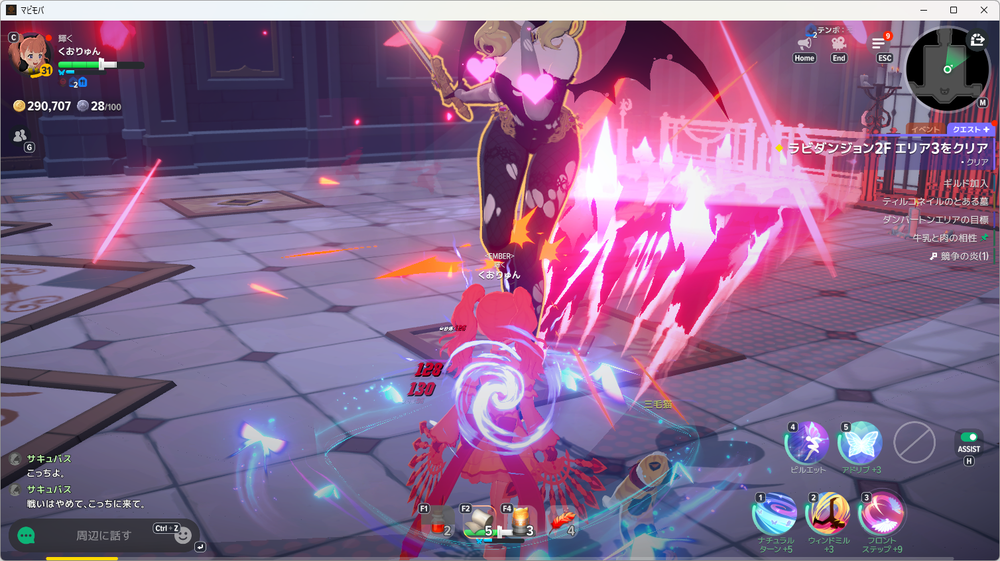
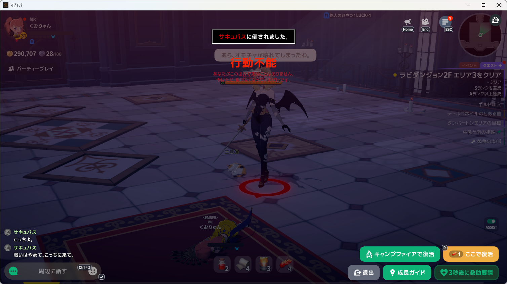

# 通常ポーションをHP70％から使う再挑戦

- 利用者の指示: 「70%で使ってみ」「そして再チャレンジ」。
- 判定: 70％基準での実使用と複数回の回復継続は確認済み。サキュバス戦クリアは未成立。
- 対象: Windows native開発版、NanoSerialHid。AI呼出し0。

## 変更・検証

回復設定の`PotionThreshold`を0.5→0.7に変更した。本体コードの変更・再導入は不要で、導入済み製品が起動時に同じ設定ファイルを読み込む経路で適用した。通常ポーションF1・待ち時間10秒、包帯の白20％・F2・待ち時間5秒、食事の使用確認、毎秒約4回の監視は維持。装備と登録は変更していない。

境界の既存テストを71％では未使用・70％で使用へ更新し、包帯試験の回復済みHPを新しいポーション基準より上の80％へ変更。回復・並行監視の関連31テスト成功。従来の50％境界を期待していた試験1件は初回に失敗し、期待する境界を今回の仕様へ更新して成功した。過去の50％設定の実測・画像は保持した。

## 実戦

敗北画面を確認後、指定済みのキャンプファイア復活をNanoで実行。HP全快を読み取り、食事Bを1回送出し、効果中・枠131→198を確認して再戦した。

| 経過 | 操作・判定 |
| --- | --- |
| 0.684秒 | 食事B送出。条件検出から176ms |
| 86.207秒 | HP69.2％でポーション候補 |
| 86.320秒 | F1 1回目。条件検出から113ms |
| 96.956秒 | HP68.2％で次のポーション候補 |
| 97.048秒 | F1 2回目。前回から10.728秒、条件検出から92ms |
| 113.453秒 | HP67.7％で次のポーション候補 |
| 113.545秒 | F1 3回目。前回から16.497秒、条件検出から93ms |
| 117.965秒 | HP47.0％・白20.7％で包帯候補 |
| 118.060秒 | F2 1回。条件検出から95ms |
| 121.954秒 | HP4.5％。ポーションの待ち時間中 |
| 122.948秒 | HUD非表示。3回目のF1から約9.4秒で、4回目の10秒に未到達 |
| 124.920秒 | 行動不能表示を認識して両処理を終了 |

実画面でポーション5→2、包帯5→4を確認。敗北後の追加消費0。初回F1後も次の使用まで生存して計3回使えたが、今回は敗北した。監視499回、観測間隔の中央値249ms・95％点269ms・最大306ms。ゲーム内の被ダメージの変動もあるため、前回との生存時間差を設定変更だけの効果とは断定しない。

原本は`artifacts/diagnostics-tools/mabinogi-main-20261008/threshold70-live001`と同名JSON・log。抜粋した[観測・送出ログ](recovery-threshold70-events.jsonl)も保持。現在は敗北画面で入力停止中。旧申請K-VLYVA6は利用者の70％再挑戦指示を受け取り下げ済み。設定は70％を維持する。
