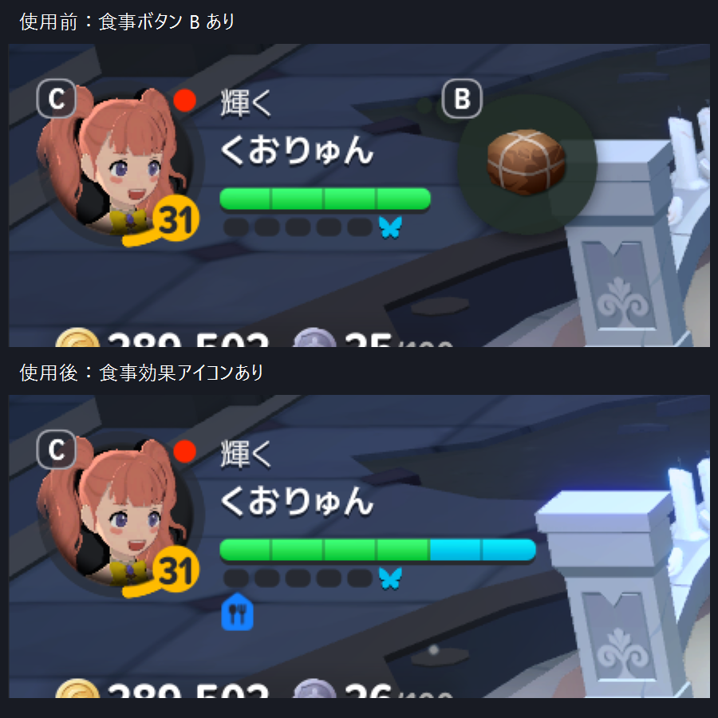

# マビノギモバイルの回復・食事調査

- 取得日: 2026-10-08
- 出典: 日本版の実ゲーム内アイテム説明、下記公式ガイド
- 確度: 日本版の説明表示、食事のキー使用と前後の表示変化、回復品の設定キー、食事Bの自動使用と効果確認、F1・F2送出と両スロット5→4は確認済み。戦闘継続・クリア、白の意味と治療との因果関係、ポーション後のHP回復は未確認。

## 日本版で確認した説明

| 対象 | 効果 | 待ち時間・条件 |
| --- | --- | --- |
| 登録中の通常回復ポーション | HP260を即時回復 | 10秒。所持38、スロット表示5 |
| 未登録の上級自動回復ポーション | HP1600を即時回復 | 10秒。登録時HP50％以下で自動使用と表示。環境設定＞ゲーム＞自動回復ポーション使用条件で変更可能。所持40 |
| 登録中の包帯 | 傷・中毒を即時治療、20秒間持続ダメージ25軽減、毎秒HP10回復 | 5秒。所持61、スロット表示5 |
| ラグジュアリーランチボックス | STR・DEX・INT・LUCK・WILL各+65、効果20分。最大HPは15分間+50％、続く5分で元に戻る。重複不可 | 町で1個使用し4→3を確認。別スタック20は維持 |

読み取り時に使用・登録・売却は行っていない。ポーションの50％はアイテム説明上の値であり、設定画面との突合と戦闘時の自動使用実測はこれから行う。

## キー割当と食事前後の実測

環境設定＞操作＞キーボード＞戦闘で、クイックスロット消耗品1はF1（補助Shift+1）、消耗品2はF2（補助Shift+2）と確認した。バッグ下部の登録品は左から通常回復ポーション、包帯なので、この登録状態ではポーションF1・包帯F2。設定は変更せず、回復品は消費していない。食事は使用前HUDにBと表示。バッグ詳細の「使用」もSpaceで実行できる。

利用者の指示でラビダンジョンからダンバートンへ退出し、食事前HUDを保存した。ランチボックス4個のスタックを開き、Nano経由のSpaceを1回送出。バッグが閉じ、食事効果の表示が出た。バッグを再度開き、4→3と別スタック20の維持を確認した。基本フードの設定は変更していない。

両画像は2203×1319。同じ走査線y=132で、HPの色が付く範囲は使用前x=133〜264の132px、使用後x=133〜330の198pxとなり、1.5倍。使用後は右に水色の部分が追加された。緑だけを数える方法と使用前の固定幅では食事後の状態を正しく扱えない。最大HPの表示端と緑・水色を含む充填範囲を区別してから割合を求める必要がある。この測定は全快2画像の比較であり、低HP判定の実証ではない。

使用前には食事Bボタンがあり、使用後は消え、HP下に青いフォークとナイフの効果アイコンが出た。アイコンのクリック後はランチボックス名と基本ステータス+65が表示されたが、残り時間は確認できなかった。効果切れ直前・食事効果の選択画面・低HP時の画像条件は未確認。この比較時点では自動的な食事の再使用は実行していない。後続の製品実装と別の食事使用は下記に区別する。

製品証拠: `artifacts/diagnostics-tools/mabinogi-main-20261008/`内の`food-before-hud`、`food-before-detail`、`food-use-once.json`、`food-after-hud`、`food-after-inventory`、`food-hud-comparison.json`、`recovery-key-settings`。観測保存はobserve-onlyで入力0、食事使用は単発Nanoキー1回、AI呼出し0。比較画像は製品の保存PNGからHUDだけを切り出したもので、Computer Useのペイロードは使用していない。

## 外部一次資料との照合

- [韓国公式・回復ポーションと包帯](https://mabinogimobile.nexon.com/Info/Guide/2751084): ポーションは即時回復・待ち10秒。包帯は対象の持続ダメージ治療と20秒の軽減・継続回復、待ち5秒。日本版の手持ち説明と役割が一致。
- [韓国公式・食事](https://mabinogimobile.nexon.com/Info/Guide/2751063): 食事の最大HP増加、時間による減衰、効果の非重複、別料理使用時の効果選択。日本版のランチ説明で最大HP増加と時間を照合。
- [韓国公式・クイックスロット](https://mabinogimobile.nexon.com/Info/Guide/2751082): 戦闘単位でポーション・包帯各5個の使用上限、敵対対象がなく戦闘終了後の補充。日本版の戦闘上限・補充の実挙動は未確認。バッグの所持数とスロット数を混同しない。

韓国版の数値・設定・上限を日本版の確認済み仕様へ無条件に昇格しない。記事本文・画像は保存せず、要約とURLだけを保持する。

## 既存画像での判定調査

製品が保存したPNG124枚で、左上のHP位置に緑の画素があるかを簡易スクリプトで調査した。全幅の緑を検出したもの28枚、緑を検出しないもの96枚、部分的な緑を検出したもの0枚。目視確認したrun017の前後は全快のHUDで、会話画面ではHUDが表示されない。

この調査はHP低下判定の成立証拠ではない。非表示・モーダルの暗転・死亡を緑の不在だけで区別できない。傷・中毒アイコンと包帯効果は未確定。後続でHUD表示を確認してから枠全長と充填率を読む製品実装を追加した。

調査結果: `artifacts/diagnostics-tools/mabinogi-main-20261008/hp-screen-probe-all.json`。Computer Useの画像ペイロードは保存していない。

## 回復付きスクリプトの実装と再挑戦

`key-assist --recovery-profile`へ、動的なHP枠全長・水色を含む充填率・50％以下のF1・10秒待ち・食事Bの使用前と効果中の画像判定を実装した。送出前に消費試行を保存し、食事後の効果とポーション後のHP増加を確認する。未確認のまま同じ消費を繰り返さない。この時点では包帯は自動使用せず、後続の利用者指示で下記の白20％条件を追加した。

`recovery-live-food.json`は町でのB送出記録。これを戦闘中の食事使用と混同して報告した。利用者の観測では再戦は食事未使用のまま敗北しているため、過去の町での試行を再戦の使用成功へ数えない。

再挑戦の実画像で、近似色の背景がHP枠へ連結する誤読と、他の効果による食事アイコンの横移動を発見して修正した。商人会話終了後には食事アイコンの時間表示が暗く重なるため、食事効果の照合だけ明るさを正規化した。`rechallenge021.json`ではHP100％・食事効果中を認識し、追加食事なしでボスへ進んだ。

サキュバス戦では、被弾時のHP表示と他効果の重なりで判別が停止した（`rechallenge022`〜`024`）。HP約99％・93％・74％の読み取りは得たが、50％以下のF1実使用は得られず、倒された。Approval Box **K-U26KLZ**の承認で食事未判別時はBだけを禁止し、HP不明は2秒観測、Space確認待ちは進行だけ停止する形へ修理した。`rechallenge029`で監視継続を確認したが、白い被弾表示によるHP全長の誤縮小が残り、再度敗北した。F1送出0。

食事Bの狭い領域を精密照合し、HPの左右の枠端を独立検出する修理を実施。窓の移動・サイズ変更も、現在のWindows描画領域とHUDの倍率から処理する。実画面3サイズと白い被弾表示をfixtureへ追加し、Host392件成功。開発版導入後の`resized-food-once`でB1回、B消失・食事効果表示・水色追加HP・全長131→198を確認した。移動後も効果中・追加消費0。これは先の食事未使用の敗北と別の試行。`rechallenge031`では縮小した停止画像を認識し、HP47.5％でF1を1回送出、ポーション表示5→4を確認した。ただしHP増加は3秒以内に観測できず停止、その後敗北。回復成功・包帯自動使用・クリアは未成立。上級ポーションへの登録変更の申請 **K-KHD6G4**は、白20％の包帯条件を先に試す利用者指示により取り下げた。

## 白い部分20％の包帯条件と再戦

利用者の指示は「HPの2割程度が白くなってしまったら包帯を使う」。白い部分をHP枠全長に対する割合として測り、20％以上ならF2を優先する処理を追加した。ポーション待ちと独立した包帯の試行・5秒待ち・使用前の白い割合を保存し、再起動でも保持する。使用後3秒で白が減らなければ追加入力を停止する。保存実画像2枚と状態管理を含むfocused 20件、Host関連396件が成功し、正規開発版へ導入した。傷・中毒の種類や、白い表示の意味が確定したという主張はしない。

`bandage-run001`では復活後、Bを1回送出してBの消失・食事アイコン・HP全長131→198を確認。追加食事0、AI呼出し0で再戦した。この戦闘では包帯を使っていない間にも、白い割合が13.1％→0％などと短時間に減少していた。HP枠が一時98pxと誤読された観測も1件あり、全観測で枠検出が成立したとは扱わない。

`bandage-run002`の実走結果:

| 経過 | HP充填率 | 白い割合 | 処理 |
| --- | --- | --- | --- |
| 7.272秒 | 41.4％ | 17.2％ | ポーション候補 |
| 7.453秒 | — | — | NanoからF1を1回送出 |
| 8.217秒 | 35.4％ | 21.7％ | 包帯候補、直前再照合で見送り |
| 8.500秒 | 36.4％ | 5.1％ | ポーション結果待ち、F2送出なし |
| 10.503秒 | 20.7％ | 8.6％ | ポーション後のHP増加を確認できず停止 |

次のobserve-onlyで敗北画面を確認した。F2は0回であり、包帯使用・白減少の因果関係・治療成功は未確認。送出直前の数値は当時のログに残っておらず、見送りの詳細条件は未確定。後続の診断へ`recovery-input-withheld`を追加し、直前観測と見送り理由を残すようにした。白の一部は包帯なしで消えるため、白すべてを負傷による最大HP減少とみなす仮説は未成立。閾値は指定どおり20％を維持した。

証拠は`artifacts/diagnostics-tools/mabinogi-main-20261008/bandage-run001/`、`bandage-run002/`、各結果JSON、`bandage-after-run002/observation.png`。原本は保持。当時の次の再挑戦方針はApproval Box **K-MVL7B2**へ送った。後に利用者から修理と再挑戦の直接指示を受けて取り下げ、上級ポーションへの変更は保留した。

## 包帯の未送出修理と実使用確認

白20％の使用要求を、送出前に取得する別画像で再判定して消していたことをテストで再現した。閾値到達時に1回分の要求を保持し、F2送出で消すよう修理した。停止画像・HUD非表示・HPゼロ・画像判定エラーでは要求を取り消す。focused 24件、最終Host関連400件が成功した。正規開発版の更新とRelease DLLのSHA-256一致も確認した。

`bandage-latch-run001`は同じ回復品登録での再戦。B1回後に食事効果表示とHP全長131→198を確認。95.996秒に白21.2％で包帯候補、96.156秒にNanoからF2を1回送出した。前後画像で包帯スロット5→4、使用後に緑の「＋10」表示を確認した。白は送出後25.8％、次に6.1％、0.5％と変化した。包帯使用は確認済みだが、未使用時にも白は減るため、白減少すべてを治療効果とは判定しない。

98.195秒にはHP48.5％でF1を1回送出し、ポーションも5→4。101.419秒にHP増加を観測できず停止し、その後の実画面で敗北を確認した。AI呼出し0。包帯の未送出修理と実使用は成立したが、ポーション後の回復と戦闘継続・クリアは未成立。

前後画像・抽出ログは[実測記録](../../evidence/mabinogi-key-assist-20261008/bandage-latch-live.md)。次の回復方針はApproval Box **K-KRVKSE**へ申請し、ゲーム入力を停止して回答待ち。上級ポーションへの変更は未実施。

## ポーション後のHP減少による監視停止の修理

利用者の修理指示を受け、`bandage-latch-run001`のHP48.5％→約3.224秒後13.1％を再現テストにした。修理前は`Review`で監視全体を終了した。HP差分には被ダメージも含まれるため、増加未観測を停止条件から除いた。HP増加は使用成功へ読み替えず、保存した送出試行と10秒の待ち時間を維持する。待ち時間中もHP・包帯を判定し、満了時の現在HPが50％以下なら次のF1へ進む。これは失敗したNano送出の再試行ではなく、現在HPと待ち時間に基づく次回使用であり、Nanoエラーは引き続き例外として停止する。

以前保存された`Pending=Potion`でも同じ処理で再開する。死亡・HUD非表示・停止画像での入力抑止と食事・包帯の条件は維持した。状態更新時の画像ファイル名は`-confirmed.png`から`-state.png`に変更し、確認待ち解除だけで回復成功が証明されたように記録しない。

再現を含むfocused 26件、最終Host関連402件が成功。正規開発版へ導入し、導入済みHost DLLとRelease成果物のSHA-256一致を確認。導入版の`key-assist --observe-only`で現ゲーム画面の取得、入力0・AI呼出し0、敗北画面のHUD非表示を確認した。決裁箱 **K-KRVKSE**で「普通のポーションで再度やって」と回答を受け、登録を変更せず再挑戦する。
